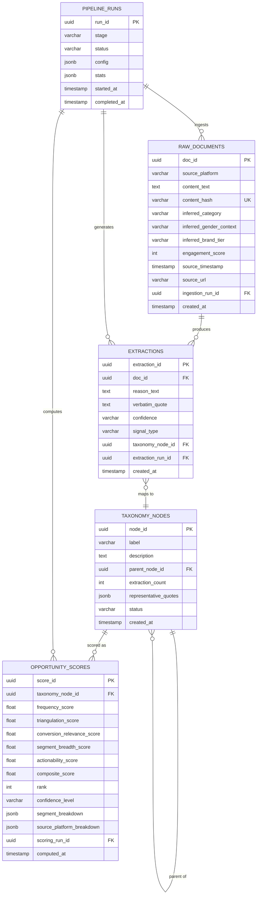

# Architecture: "Pulse" — Wishlist-to-Purchase Discovery Engine
**Technical Architecture Document | Myntra Growth Team**  
*Version 1.0 — August 2026*

---

## 1. Architecture Overview

Pulse is a **three-tier, LLM-powered batch analytics system** — not a conversational AI product. The architecture is built around a strict separation of concerns: data acquisition runs independently of analysis, analysis runs independently of presentation, and business context is injected only at the scoring layer — never during extraction.

### 1.1 High-Level System Topology

```
┌─────────────────────────────────────────────────────────────────────────────┐
│                          EXTERNAL DATA SOURCES                             │
│  App/Play Store • Reddit API • YouTube API • X/Twitter • Forums • Reviews  │
└────────────────────────────────────┬────────────────────────────────────────┘
                                     │ Scrapers / APIs / Manual Upload
                                     ▼
┌─────────────────────────────────────────────────────────────────────────────┐
│                     BACKEND — Railway (Python / FastAPI)                    │
│                                                                             │
│  ┌───────────────────┐   ┌───────────────────┐   ┌──────────────────────┐  │
│  │  Ingestion Layer  │──▶│  Extraction Layer  │──▶│  Aggregation Layer   │  │
│  │  (Scrapers, APIs, │   │  (Gemini API —     │   │  (Clustering,        │  │
│  │   Normalization)  │   │   Structured JSON) │   │   Taxonomy, Scoring) │  │
│  └───────────────────┘   └───────────────────┘   └──────────┬───────────┘  │
│                                                              │              │
│  ┌───────────────────────────────────────────────────────────┘              │
│  │                                                                          │
│  ▼                                                                          │
│  ┌──────────────────────────────────────────────────────────────────────┐   │
│  │                      PostgreSQL Database                             │   │
│  │  raw_documents • extractions • taxonomy_nodes • opportunity_scores  │   │
│  └──────────────────────────────────────────────────────────────────────┘   │
│                                                                             │
│  ┌──────────────────────────────────────────────────────────────────────┐   │
│  │                         REST API Layer                               │   │
│  │  /api/opportunities • /api/segments • /api/evidence • /api/pipeline │   │
│  └──────────────────────────────────┬───────────────────────────────────┘   │
└─────────────────────────────────────┼───────────────────────────────────────┘
                                      │ HTTPS / JSON
                                      ▼
┌─────────────────────────────────────────────────────────────────────────────┐
│                       FRONTEND — Vercel (Next.js / React)                   │
│                                                                             │
│  ┌─────────────────┐  ┌──────────────────┐  ┌───────────────────────────┐  │
│  │ Opportunity      │  │ Segment          │  │ Evidence Drill-Down       │  │
│  │ Rankings         │  │ Breakdowns       │  │ (Source Quote Explorer)   │  │
│  │ Dashboard        │  │ & Filters        │  │                           │  │
│  └─────────────────┘  └──────────────────┘  └───────────────────────────┘  │
│                                                                             │
│                  UI/UX faithfully implements Google Stitch designs           │
└─────────────────────────────────────────────────────────────────────────────┘
```

### 1.2 Core Architectural Principles

| # | Principle | Rationale |
|---|-----------|-----------|
| 1 | **Batch-First, Not Conversational** | Corpus-wide systematic extraction requires processing every document, not ad-hoc retrieval |
| 2 | **Extraction–Scoring Separation** | LLM extraction prompts must remain context-light (no business goal priming) to prevent confirmation bias; business weighting is applied only in the scoring layer |
| 3 | **Structured Output Over Free Text** | Gemini returns JSON-schema-validated extractions, not prose — enabling programmatic aggregation |
| 4 | **Triangulation by Design** | Cross-source validation is a first-class metric, not a post-hoc filter |
| 5 | **Full Evidence Traceability** | Every scored opportunity links back to exact source quotes, platforms, and timestamps |
| 6 | **Idempotent Pipelines** | Each pipeline stage can be re-run without side effects — safe retries on failure |

---

## 2. Backend Architecture (Railway)

### 2.1 Technology Stack

| Component | Technology | Justification |
|-----------|-----------|---------------|
| **Runtime** | Python 3.12+ | Rich NLP/data ecosystem, first-class Gemini SDK support |
| **Web Framework** | FastAPI | Async-native, automatic OpenAPI docs, Pydantic validation |
| **Task Queue** | Celery + Redis | Decouple long-running batch extraction from API request lifecycle |
| **Database** | PostgreSQL (Railway-managed) | Relational integrity for taxonomy relationships, JSONB for flexible extraction storage |
| **LLM Client** | `google-genai` SDK | Official Gemini API client with structured output support |
| **ORM** | SQLAlchemy 2.0 | Type-safe async queries, migration support via Alembic |

### 2.2 Module Structure

```
backend/
├── app/
│   ├── main.py                    # FastAPI app entry point, CORS, lifespan
│   ├── config.py                  # Environment config (Railway env vars)
│   │
│   ├── ingestion/                 # ── Layer 1: Data Acquisition ──
│   │   ├── scrapers/
│   │   │   ├── playstore.py       # Google Play Store review scraper
│   │   │   ├── appstore.py        # Apple App Store review scraper
│   │   │   ├── reddit.py          # Reddit API client (PRAW)
│   │   │   ├── youtube.py         # YouTube Data API comment fetcher
│   │   │   └── manual_upload.py   # CSV/JSON corpus upload handler
│   │   ├── normalizer.py          # Text cleanup, de-duplication, language detection
│   │   └── metadata_enricher.py   # Source metadata, engagement metrics, category inference
│   │
│   ├── extraction/                # ── Layer 2: LLM Reason Extraction ──
│   │   ├── prompts/
│   │   │   ├── extraction_system.txt    # System prompt (context-light, no business goal)
│   │   │   └── extraction_few_shot.json # Few-shot examples for structured output
│   │   ├── gemini_client.py       # Gemini API wrapper with retry, rate limiting
│   │   ├── schema.py              # Pydantic models for structured extraction output
│   │   └── batch_processor.py     # Batch orchestration: chunk, extract, store
│   │
│   ├── aggregation/               # ── Layer 3 & 4: Clustering + Scoring ──
│   │   ├── clustering.py          # Semantic clustering of extracted reasons
│   │   ├── taxonomy.py            # Taxonomy node management (CRUD, hierarchy)
│   │   ├── triangulation.py       # Cross-source validation scoring
│   │   ├── segment_analyzer.py    # Segment-level prevalence computation
│   │   └── opportunity_scorer.py  # Composite scoring: freq × triangulation × relevance
│   │
│   ├── api/                       # ── REST API Endpoints ──
│   │   ├── routes/
│   │   │   ├── opportunities.py   # GET ranked opportunity areas
│   │   │   ├── segments.py        # GET segment breakdowns & filters
│   │   │   ├── evidence.py        # GET source quotes for an opportunity
│   │   │   ├── pipeline.py        # POST trigger pipeline runs, GET status
│   │   │   └── corpus.py          # GET corpus stats, POST manual uploads
│   │   └── dependencies.py        # Shared deps: DB session, auth, pagination
│   │
│   ├── models/                    # ── SQLAlchemy ORM Models ──
│   │   ├── document.py            # Raw ingested documents
│   │   ├── extraction.py          # Per-document structured extractions
│   │   ├── taxonomy_node.py       # Opportunity area taxonomy
│   │   ├── opportunity_score.py   # Computed scores per taxonomy node
│   │   └── pipeline_run.py        # Pipeline execution logs & status
│   │
│   └── workers/                   # ── Celery Background Tasks ──
│       ├── ingestion_tasks.py     # Scraper scheduling & execution
│       ├── extraction_tasks.py    # Batch LLM extraction jobs
│       └── aggregation_tasks.py   # Clustering, scoring recomputation
│
├── alembic/                       # Database migrations
├── tests/
├── requirements.txt
├── Procfile                       # Railway process types
└── railway.toml                   # Railway deployment config
```

---

## 3. Data Pipeline — Stage-by-Stage Detail

### 3.1 Stage 1: Ingestion & Normalization

```
External Sources ──► Scrapers/APIs ──► Raw Text ──► Normalizer ──► raw_documents table
```

**Responsibilities:**
- Pull raw text from each configured source (API calls, scraping, or manual CSV/JSON upload).
- Normalize text: strip HTML, handle emoji, detect and filter non-English content, truncate extremely long posts.
- De-duplicate: compute content hashes to prevent storing identical text from overlapping sources.
- Enrich with source metadata before storage.

**Unified Document Schema (stored in `raw_documents`):**

```json
{
  "doc_id": "uuid",
  "source_platform": "reddit | playstore | appstore | youtube | twitter | forum | ecommerce",
  "source_url": "https://...",
  "source_subreddit": "r/IndianFashionAddicts",          // if applicable
  "author_id_hash": "sha256_anonymized",                  // privacy-safe
  "content_text": "I wishlisted this kurta but...",
  "content_language": "en",
  "timestamp": "2026-05-14T10:30:00Z",
  "engagement_score": 47,                                 // upvotes, likes, helpful
  "inferred_category": "ethnic_wear | western | footwear | accessories | general",
  "inferred_brand_tier": "premium | mid | value | unknown",
  "inferred_gender_context": "women | men | unisex | unknown",
  "content_hash": "sha256_for_dedup",
  "ingestion_run_id": "uuid",
  "created_at": "2026-08-18T12:00:00Z"
}
```

**Source-Specific Adapters:**

| Source | Adapter | Method | Rate Limiting |
|--------|---------|--------|---------------|
| Google Play Store | `playstore.py` | `google-play-scraper` library | 100 req/min |
| Apple App Store | `appstore.py` | `app-store-scraper` library | 50 req/min |
| Reddit | `reddit.py` | PRAW (Reddit API) | OAuth, 60 req/min |
| YouTube | `youtube.py` | YouTube Data API v3 | 10,000 units/day |
| X / Twitter | `twitter.py` | Twitter API v2 (Basic tier) | Tier-dependent |
| Manual Upload | `manual_upload.py` | CSV/JSON POST endpoint | N/A |

### 3.2 Stage 2: LLM Extraction (Gemini — Context-Light)

```
raw_documents ──► Batch Chunker ──► Gemini API (Structured Output) ──► extractions table
```

> **Critical Guardrail:** The extraction prompt must contain **ZERO** references to "wishlist," "conversion," "purchase," or any business KPI. The LLM reads raw user text and extracts whatever behavioral signals are present — objectively and without priming.

**Extraction System Prompt (Illustrative):**

```
You are an expert qualitative researcher analyzing user-generated content about
online fashion shopping experiences. For each piece of text provided, extract ALL
discrete reasons, behaviors, frictions, hesitations, motivations, and decision
factors mentioned or implied by the user.

Return structured JSON. Each extracted item must include:
- reason_text: A concise paraphrase of the specific reason/behavior
- verbatim_quote: The exact phrase from the original text supporting this extraction  
- confidence: high | medium | low
- signal_type: friction | motivation | behavior | uncertainty | comparison | external_validation
```

**Structured Extraction Output Schema:**

```json
{
  "doc_id": "uuid_ref_to_raw_document",
  "extraction_run_id": "uuid",
  "model_version": "gemini-2.5-flash",
  "items": [
    {
      "extraction_id": "uuid",
      "reason_text": "Uncertain whether the garment's fit matches their body type based on conflicting size reviews",
      "verbatim_quote": "reviews say it runs small but the size chart says otherwise, so confused",
      "confidence": "high",
      "signal_type": "uncertainty",
      "preliminary_cluster_hint": "fit_sizing"   // soft hint, not authoritative
    }
  ],
  "processed_at": "2026-08-18T14:00:00Z"
}
```

**Batch Processing Strategy:**

| Parameter | Value | Rationale |
|-----------|-------|-----------|
| Batch size | 20 documents per API call | Balance throughput vs. context window limits |
| Concurrency | 5 parallel Celery workers | Stay within Gemini API rate limits |
| Retry policy | Exponential backoff, max 3 retries | Handle transient API errors |
| Model | `gemini-2.5-flash` | Cost-efficient for high-volume structured extraction |
| Temperature | 0.1 | Maximize extraction consistency |
| Response format | JSON Schema (Gemini structured output) | Eliminate parsing errors |

### 3.3 Stage 3: Clustering & Taxonomy Construction

```
extractions ──► Embedding + Clustering ──► taxonomy_nodes table
```

**Approach: Hybrid LLM-Assisted Clustering**

1. **Embedding Generation:** Compute sentence embeddings for each `reason_text` using a lightweight embedding model (e.g., `text-embedding-004`).
2. **Hierarchical Clustering:** Apply agglomerative clustering with cosine distance to group semantically similar extractions.
3. **LLM-Assisted Labeling:** Pass each cluster's top-N representative extractions to Gemini to generate a human-readable taxonomy label and description.
4. **Manual Review Hooks:** Expose taxonomy via API for PM review and adjustment before scoring.

**Taxonomy Node Schema:**

```json
{
  "node_id": "uuid",
  "label": "Fit & Sizing Confidence Gap",
  "description": "User uncertainty about garment fit due to inconsistent sizing, unreliable size charts, or conflicting review signals",
  "parent_node_id": null,               // supports hierarchy
  "extraction_count": 342,              // number of linked extractions
  "representative_quotes": [            // top-5 exemplar quotes
    "reviews say it runs small but the size chart says otherwise",
    "I'm between M and L and there's no way to know which will fit"
  ],
  "created_at": "2026-08-18T15:00:00Z",
  "status": "auto_generated | pm_reviewed | merged | archived"
}
```

**Initial Seed Taxonomy (from Problem Statement analysis):**

| # | Opportunity Area | Description |
|---|-----------------|-------------|
| 1 | Fit & Sizing Confidence Gap | Body-type uncertainty, size chart distrust, review conflicts on fit |
| 2 | Styling & Outfit Context Deficit | Cannot visualize how item fits into existing wardrobe or occasion |
| 3 | Review Authenticity & Trust Deficit | Distrust of on-platform reviews, seek external validation |
| 4 | Decision Deferral & Procrastination | Active postponement despite stated interest |
| 5 | Social Proof & Peer Validation Needs | Waiting for friends, influencers, or community opinions before buying |
| 6 | Bookmarking vs. High-Intent Ambiguity | Wishlist used as moodboard/bookmark, not genuine purchase intent |
| 7 | Cross-Option Evaluation Friction | Difficulty comparing similar wishlisted items systematically |
| 8 | Occasion Mismatch & Seasonality Shift | Right item, wrong time — occasion passed or season changed |
| 9 | Post-Wishlist Re-engagement Failure | User forgets about wishlisted items, no re-engagement trigger |
| 10 | Quality & Durability Uncertainty | Material, stitching, color-accuracy concerns from past experience |

### 3.4 Stage 4: Quantification & Opportunity Scoring

```
taxonomy_nodes + extractions + raw_documents ──► opportunity_scores table
```

> **This is where business context enters.** The extraction and clustering stages are context-free. The scoring stage applies the 30-day wishlist-to-purchase conversion lens to rank which opportunity areas are most actionable.

**Scoring Dimensions:**

```
┌─────────────────────────────────────────────────────────────────┐
│                  COMPOSITE OPPORTUNITY SCORE                     │
│                                                                  │
│  Score = Frequency × Triangulation × Conversion Relevance        │
│          × Segment Breadth × Actionability                       │
│                                                                  │
│  ┌──────────────┐  ┌───────────────┐  ┌──────────────────────┐  │
│  │ Frequency    │  │ Triangulation │  │ Conversion           │  │
│  │ (0.0 – 1.0) │  │ (0.0 – 1.0)  │  │ Relevance (0.0–1.0) │  │
│  │              │  │               │  │                      │  │
│  │ % of total   │  │ # of distinct │  │ LLM-assessed link   │  │
│  │ corpus       │  │ platforms     │  │ to wishlist-purchase │  │
│  │ mentioning   │  │ confirming    │  │ conversion (scored   │  │
│  │ this area    │  │ this signal   │  │ at THIS stage only)  │  │
│  └──────────────┘  └───────────────┘  └──────────────────────┘  │
│                                                                  │
│  ┌──────────────────┐  ┌────────────────────────────────────┐   │
│  │ Segment Breadth  │  │ Actionability                      │   │
│  │ (0.0 – 1.0)     │  │ (0.0 – 1.0)                       │   │
│  │                  │  │                                    │   │
│  │ Prevalence across│  │ Can this be addressed with         │   │
│  │ user segments    │  │ non-monetary product levers?       │   │
│  │ (not concentrated│  │ (excludes pure price complaints)   │   │
│  │ in one niche)    │  │                                    │   │
│  └──────────────────┘  └────────────────────────────────────┘   │
└─────────────────────────────────────────────────────────────────┘
```

**Opportunity Score Record:**

```json
{
  "score_id": "uuid",
  "taxonomy_node_id": "uuid_ref",
  "scoring_run_id": "uuid",
  "frequency_score": 0.23,
  "triangulation_score": 0.83,
  "conversion_relevance_score": 0.91,
  "segment_breadth_score": 0.67,
  "actionability_score": 0.88,
  "composite_score": 0.78,
  "rank": 1,
  "confidence_level": "high | medium | low",
  "segment_breakdown": {
    "by_category": { "ethnic": 0.31, "western": 0.19, "footwear": 0.12 },
    "by_gender": { "women": 0.27, "men": 0.15 },
    "by_price_tier": { "premium": 0.22, "mid": 0.25, "value": 0.18 },
    "by_geography": { "metro": 0.20, "non_metro": 0.24 }
  },
  "source_platform_breakdown": {
    "reddit": 87, "playstore": 134, "youtube": 56, "appstore": 43, "twitter": 22
  },
  "computed_at": "2026-08-18T16:00:00Z"
}
```

---

## 4. Database Schema (PostgreSQL)

### 4.1 Entity-Relationship Diagram



### 4.2 Key Indexes

```sql
-- Performance-critical query patterns
CREATE INDEX idx_documents_platform       ON raw_documents (source_platform);
CREATE INDEX idx_documents_category       ON raw_documents (inferred_category);
CREATE INDEX idx_documents_hash           ON raw_documents (content_hash);
CREATE INDEX idx_extractions_doc          ON extractions (doc_id);
CREATE INDEX idx_extractions_taxonomy     ON extractions (taxonomy_node_id);
CREATE INDEX idx_extractions_signal_type  ON extractions (signal_type);
CREATE INDEX idx_scores_rank             ON opportunity_scores (rank);
CREATE INDEX idx_scores_composite        ON opportunity_scores (composite_score DESC);
CREATE INDEX idx_taxonomy_parent         ON taxonomy_nodes (parent_node_id);
CREATE INDEX idx_pipeline_status         ON pipeline_runs (stage, status);
```

---

## 5. REST API Design

### 5.1 API Resource Map

| Method | Endpoint | Description | Auth |
|--------|----------|-------------|------|
| `GET` | `/api/v1/opportunities` | Ranked opportunity areas with scores | API Key |
| `GET` | `/api/v1/opportunities/{id}` | Single opportunity detail + segment breakdown | API Key |
| `GET` | `/api/v1/opportunities/{id}/evidence` | Source quotes backing an opportunity area | API Key |
| `GET` | `/api/v1/segments` | Available segment dimensions & values | API Key |
| `GET` | `/api/v1/segments/{dimension}/breakdown` | Opportunity scores filtered by segment | API Key |
| `GET` | `/api/v1/corpus/stats` | Corpus-level statistics (count, platform mix, etc.) | API Key |
| `POST` | `/api/v1/corpus/upload` | Manual corpus upload (CSV/JSON) | API Key |
| `POST` | `/api/v1/pipeline/run` | Trigger a pipeline stage execution | API Key |
| `GET` | `/api/v1/pipeline/status` | Current pipeline run status & history | API Key |
| `GET` | `/api/v1/taxonomy` | Full taxonomy tree | API Key |
| `PUT` | `/api/v1/taxonomy/{id}` | Edit taxonomy node (PM review workflow) | API Key |

### 5.2 Key Response Shapes

**`GET /api/v1/opportunities`**

```json
{
  "scoring_run_id": "uuid",
  "computed_at": "2026-08-18T16:00:00Z",
  "corpus_size": 4823,
  "opportunities": [
    {
      "rank": 1,
      "node_id": "uuid",
      "label": "Fit & Sizing Confidence Gap",
      "description": "...",
      "composite_score": 0.78,
      "frequency_score": 0.23,
      "triangulation_score": 0.83,
      "conversion_relevance_score": 0.91,
      "extraction_count": 342,
      "confidence_level": "high",
      "top_sources": ["playstore", "reddit", "youtube"],
      "top_segments": ["women", "ethnic_wear", "mid_tier"]
    }
  ]
}
```

**`GET /api/v1/opportunities/{id}/evidence`**

```json
{
  "opportunity": { "node_id": "uuid", "label": "Fit & Sizing Confidence Gap" },
  "evidence_count": 342,
  "evidence": [
    {
      "extraction_id": "uuid",
      "reason_text": "Uncertain whether garment fit matches body type",
      "verbatim_quote": "reviews say it runs small but the size chart says otherwise",
      "source_platform": "playstore",
      "source_url": "https://...",
      "confidence": "high",
      "engagement_score": 47,
      "source_timestamp": "2026-05-14T10:30:00Z"
    }
  ],
  "pagination": { "page": 1, "per_page": 20, "total": 342 }
}
```

---

## 6. Frontend Architecture (Vercel)

### 6.1 Technology Stack

| Component | Technology |
|-----------|-----------|
| **Framework** | Next.js 15 (App Router) |
| **Language** | TypeScript |
| **Styling** | CSS Modules + design tokens from Google Stitch specs |
| **Charts** | Recharts or Nivo (for bar charts, heatmaps, treemaps) |
| **State Management** | React Query (TanStack Query) for server state |
| **Deployment** | Vercel (auto-deploy from main branch) |

### 6.2 Page & Component Architecture

```
frontend/
├── app/
│   ├── layout.tsx                     # Root layout, global nav, theme
│   ├── page.tsx                       # Dashboard home — ranked opportunities overview
│   │
│   ├── opportunities/
│   │   └── [id]/
│   │       └── page.tsx               # Deep-dive: single opportunity detail + evidence
│   │
│   ├── segments/
│   │   └── page.tsx                   # Segment explorer — filter by category, gender, tier
│   │
│   ├── corpus/
│   │   └── page.tsx                   # Corpus stats & manual upload interface
│   │
│   └── pipeline/
│       └── page.tsx                   # Pipeline run status & trigger controls
│
├── components/
│   ├── dashboard/
│   │   ├── OpportunityRankingTable.tsx # Sortable ranked table with score columns
│   │   ├── OpportunityScoreCard.tsx    # Individual score card with sparklines
│   │   ├── CompositeScoreBar.tsx       # Stacked score visualization
│   │   └── CorpusSummaryHeader.tsx     # Headline metrics (total docs, sources, run date)
│   │
│   ├── charts/
│   │   ├── TriangulationHeatmap.tsx    # Platform × Opportunity heatmap
│   │   ├── SegmentBreakdownChart.tsx   # Bar/radar chart for segment analysis
│   │   ├── SourceDistributionPie.tsx   # Platform contribution pie chart
│   │   └── FrequencyTrendLine.tsx      # Temporal trend if time-series data available
│   │
│   ├── evidence/
│   │   ├── EvidenceQuoteList.tsx       # Paginated source quote explorer
│   │   ├── QuoteCard.tsx              # Individual quote with metadata badge
│   │   └── SourceFilter.tsx           # Filter evidence by platform, confidence, date
│   │
│   ├── taxonomy/
│   │   ├── TaxonomyTree.tsx           # Interactive taxonomy hierarchy viewer
│   │   └── TaxonomyNodeEditor.tsx     # PM review: merge, rename, archive nodes
│   │
│   └── shared/
│       ├── Navbar.tsx
│       ├── Sidebar.tsx
│       ├── FilterPanel.tsx
│       ├── LoadingState.tsx
│       └── EmptyState.tsx
│
├── lib/
│   ├── api.ts                         # API client (fetch wrapper with base URL, auth)
│   ├── types.ts                       # TypeScript interfaces mirroring API schemas
│   └── constants.ts                   # Segment labels, color palettes, config
│
├── styles/
│   ├── globals.css                    # Design tokens, CSS custom properties
│   ├── dashboard.module.css
│   └── evidence.module.css
│
└── public/
    └── ...
```

### 6.3 Dashboard Views

```
┌──────────────────────────────────────────────────────────────────────┐
│  INTENTLY — Discovery Engine Dashboard                               │
├────────┬─────────────────────────────────────────────────────────────┤
│        │                                                             │
│  NAV   │  ┌─────────────────────────────────────────────────────┐   │
│        │  │  CORPUS SUMMARY: 4,823 documents │ 6 platforms │    │   │
│ Home   │  │  Last run: Aug 18, 2026 │ 10 opportunity areas     │   │
│        │  └─────────────────────────────────────────────────────┘   │
│ Opps   │                                                             │
│        │  ┌─ RANKED OPPORTUNITY AREAS ──────────────────────────┐   │
│ Segs   │  │ # │ Area             │ Score │ Freq │ Tri │ Conv   │   │
│        │  │ 1 │ Fit/Size Gap     │ 0.78  │ 0.23 │ 5/6 │ 0.91  │   │
│ Corpus │  │ 2 │ Styling Deficit  │ 0.72  │ 0.19 │ 4/6 │ 0.88  │   │
│        │  │ 3 │ Review Distrust  │ 0.65  │ 0.17 │ 5/6 │ 0.79  │   │
│ Pipe   │  │ 4 │ Decision Defer   │ 0.61  │ 0.15 │ 3/6 │ 0.84  │   │
│        │  │ ...                                                 │   │
│        │  └─────────────────────────────────────────────────────┘   │
│        │                                                             │
│        │  ┌─ TRIANGULATION HEATMAP ─┐  ┌─ SEGMENT BREAKDOWN ──┐   │
│        │  │ Platform × Opportunity  │  │ Category │ Gender     │   │
│        │  │ matrix visualization    │  │ bar chart breakdown   │   │
│        │  └─────────────────────────┘  └────────────────────────┘   │
└────────┴─────────────────────────────────────────────────────────────┘
```

---

## 7. LLM Orchestration Layer

### 7.1 Gemini API Integration

```
┌───────────────────────────────────────────────────────────────┐
│                    Gemini Client Wrapper                       │
│                                                               │
│  ┌─────────────┐  ┌──────────────┐  ┌──────────────────────┐ │
│  │ Rate Limiter │  │ Retry Logic  │  │ Response Validator  │ │
│  │ (Token       │  │ (Exp backoff │  │ (JSON Schema        │ │
│  │  bucket)     │  │  3 retries)  │  │  validation)        │ │
│  └─────────────┘  └──────────────┘  └──────────────────────┘ │
│                                                               │
│  ┌─────────────────────────────────────────────────────────┐ │
│  │              Prompt Template Manager                     │ │
│  │  • extraction_system.txt   (context-light)              │ │
│  │  • clustering_label.txt    (cluster naming)             │ │
│  │  • scoring_relevance.txt   (business-context-aware)     │ │
│  └─────────────────────────────────────────────────────────┘ │
└───────────────────────────────────────────────────────────────┘
```

### 7.2 Prompt Isolation Policy

| Prompt Purpose | Business Context Allowed? | Model | Temperature |
|----------------|--------------------------|-------|-------------|
| **Extraction** (Layer 2) | ❌ Strictly forbidden | `gemini-2.5-flash` | 0.1 |
| **Cluster Labeling** (Layer 3) | ❌ No — labels describe what users say, not business priority | `gemini-2.5-flash` | 0.2 |
| **Conversion Relevance Scoring** (Layer 4) | ✅ Required — this is where "wishlist-to-purchase" context enters | `gemini-2.5-pro` | 0.1 |
| **Evidence Drill-Down** (Optional) | ✅ Allowed — PM asks targeted questions | `gemini-2.5-flash` | 0.3 |

### 7.3 Cost & Throughput Estimates

| Metric | Estimate |
|--------|----------|
| Corpus size (Phase 1) | ~5,000 documents |
| Avg tokens per document | ~200 tokens |
| Extraction calls | ~250 API calls (batch of 20) |
| Estimated extraction cost | ~$2–5 (Flash pricing) |
| Scoring calls | ~50 API calls |
| Total pipeline run cost | < $10 per full run |
| Pipeline run duration | ~30–60 minutes (full corpus) |

---

## 8. Deployment & Infrastructure

### 8.1 Railway Configuration

```toml
# railway.toml
[build]
builder = "DOCKERFILE"

[deploy]
startCommand = "uvicorn app.main:app --host 0.0.0.0 --port $PORT"
healthcheckPath = "/health"
restartPolicyType = "ON_FAILURE"
restartPolicyMaxRetries = 3
```

**Railway Services:**

| Service | Type | Purpose |
|---------|------|---------|
| `intently-api` | Web Service | FastAPI server — serves REST API to frontend |
| `intently-worker` | Worker | Celery worker — executes background pipeline tasks |
| `intently-db` | PostgreSQL Plugin | Managed PostgreSQL database |
| `intently-redis` | Redis Plugin | Celery message broker & rate-limiter state |

### 8.2 Vercel Configuration

```json
// vercel.json
{
  "framework": "nextjs",
  "buildCommand": "next build",
  "outputDirectory": ".next",
  "env": {
    "NEXT_PUBLIC_API_BASE_URL": "@intently-api-url"
  },
  "headers": [
    {
      "source": "/(.*)",
      "headers": [
        { "key": "X-Frame-Options", "value": "DENY" },
        { "key": "X-Content-Type-Options", "value": "nosniff" }
      ]
    }
  ]
}
```

### 8.3 Environment Variables

| Variable | Service | Description |
|----------|---------|-------------|
| `DATABASE_URL` | Backend | Railway PostgreSQL connection string |
| `REDIS_URL` | Backend | Railway Redis connection string |
| `GEMINI_API_KEY` | Backend | Google AI Studio / Vertex Gemini API key |
| `API_SECRET_KEY` | Backend | API key for frontend → backend auth |
| `CORS_ORIGINS` | Backend | Allowed frontend origin (Vercel URL) |
| `NEXT_PUBLIC_API_BASE_URL` | Frontend | Backend API base URL |
| `NEXT_PUBLIC_API_KEY` | Frontend | API key for authenticated requests |

---

## 9. Data Flow — End-to-End Pipeline Sequence

```
                                    PIPELINE EXECUTION FLOW
                                    
    ┌─────────┐    ┌─────────┐    ┌─────────┐    ┌─────────┐    ┌─────────┐
    │ TRIGGER  │───▶│ INGEST  │───▶│ EXTRACT │───▶│ CLUSTER │───▶│  SCORE  │
    │          │    │         │    │         │    │         │    │         │
    │ Manual   │    │ Pull    │    │ Gemini  │    │ Embed + │    │ Freq ×  │
    │ or Cron  │    │ sources │    │ struct  │    │ group + │    │ Tri ×   │
    │          │    │ Norm +  │    │ JSON    │    │ label   │    │ Conv ×  │
    │          │    │ dedup   │    │ extract │    │ taxonomy│    │ Action  │
    └─────────┘    └────┬────┘    └────┬────┘    └────┬────┘    └────┬────┘
                        │              │              │              │
                        ▼              ▼              ▼              ▼
                   raw_documents  extractions   taxonomy_nodes  opp_scores
                     (table)       (table)        (table)        (table)
                                                                     │
                                                                     ▼
                                                              ┌─────────────┐
                                                              │  REST API   │
                                                              │  serves to  │
                                                              │  Frontend   │
                                                              └─────────────┘
```

**Pipeline State Machine:**

```
IDLE ──► INGESTING ──► EXTRACTING ──► CLUSTERING ──► SCORING ──► COMPLETE
  ▲                                                                  │
  └──────────────────────────────────────────────────────────────────┘
                              (ready for next run)

  Any stage can transition to → FAILED (with error details logged)
```

---

## 10. Security & Operational Concerns

### 10.1 Security Measures

| Concern | Mitigation |
|---------|------------|
| **API Authentication** | API key header (`X-API-Key`) on all backend endpoints |
| **CORS** | Restrict to Vercel deployment domain only |
| **Data Privacy** | Author IDs are SHA-256 hashed before storage — no PII retained |
| **Gemini API Key** | Stored in Railway env vars, never committed to code |
| **SQL Injection** | Parameterized queries via SQLAlchemy ORM |
| **Rate Limiting** | Backend rate-limits incoming requests (FastAPI middleware) |

### 10.2 Observability

| Signal | Tool |
|--------|------|
| **Application Logs** | Railway log stream (structured JSON logging) |
| **Pipeline Run Tracking** | `pipeline_runs` table with stage, status, stats, duration |
| **API Health** | `/health` endpoint returning DB connectivity + last pipeline run status |
| **Error Alerting** | Railway deployment notifications + optional webhook |

### 10.3 Scaling Considerations

| Bottleneck | Current Strategy | Future Path |
|-----------|-----------------|-------------|
| Gemini API rate limits | 5 concurrent workers, token bucket rate limiter | Request quota increase |
| Large corpus (>10K docs) | Paginated batch processing with checkpointing | Streaming pipeline with Apache Beam |
| Dashboard query latency | Pre-computed scores, indexed tables | Materialized views, Redis caching |
| Taxonomy evolution | Manual PM review + LLM relabeling | Active learning feedback loop |

---

## 11. Development & Testing Strategy

### 11.1 Testing Layers

| Layer | Approach |
|-------|----------|
| **Unit Tests** | `pytest` — test normalizer, scoring logic, taxonomy CRUD |
| **Integration Tests** | Test full pipeline with a small fixture corpus (~50 documents) |
| **API Tests** | `httpx` + `pytest` — test all REST endpoints with mock data |
| **LLM Output Validation** | Schema validation on Gemini responses, golden-set regression tests |
| **Frontend Tests** | Vitest + React Testing Library — component rendering & data display |

### 11.2 Local Development

```bash
# Backend
cd backend
python -m venv venv && source venv/bin/activate
pip install -r requirements.txt
cp .env.example .env   # fill in GEMINI_API_KEY, DATABASE_URL
uvicorn app.main:app --reload

# Frontend
cd frontend
npm install
cp .env.local.example .env.local   # fill in NEXT_PUBLIC_API_BASE_URL
npm run dev
```

---

## 12. Appendix: Key Architectural Decision Records

| Decision | Choice | Alternatives Considered | Rationale |
|----------|--------|------------------------|-----------|
| Pipeline pattern | Batch analytics | RAG chatbot | Problem requires corpus-wide systematic extraction, not ad-hoc Q&A |
| Backend language | Python | Node.js | Superior data/ML ecosystem, native Gemini SDK, team familiarity |
| Database | PostgreSQL | MongoDB, SQLite | Relational integrity for taxonomy hierarchy, JSONB for flexibility, Railway-native |
| Task queue | Celery + Redis | Python `asyncio` only | Long-running extraction jobs need to be decoupled from web process |
| Frontend framework | Next.js | Vite + React | SSR for SEO (if needed), API routes, Vercel-native deployment |
| Extraction model | Gemini 2.5 Flash | Gemini 2.5 Pro | Cost-efficient for high-volume extraction; Pro reserved for scoring |
| Clustering | Embeddings + Agglomerative | K-means, LDA | Better for unknown cluster count, semantic similarity aware |
| Context separation | Architectural principle | Single-prompt approach | Prevents confirmation bias; produces both unbiased discovery and business-relevant scoring |
